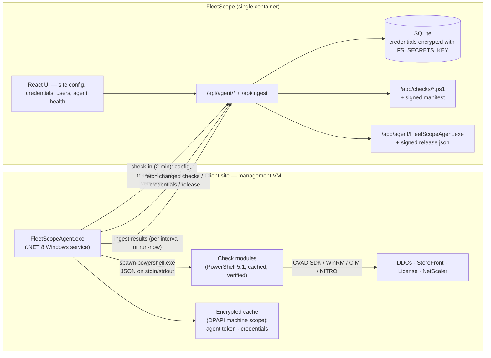

# FleetScope Agent — design

Status: **revision 3, for review** (2026-09-06). Nothing here is built yet.
Supersedes the PowerShell collector; the ingest payload contract in `COLLECTOR_CONTRACT.md`
stays valid and is extended, not replaced.

**Changes in revision 3 (from review):**
- The **Windows service account is now dashboard-managed too** (§4.4), consistent with the MSP's existing practice of holding client monitoring accounts centrally for PRTG. Includes password rotation from the dashboard without restart, lockout protection, and account-change semantics. gMSA remains a per-client option for later.
- The install command no longer needs `--service-account`; it comes from the site config (§4.2, §8).

**Changes in revision 2 (from review):**
- Device credentials (NetScaler today) are **managed in the dashboard** and delivered to agents (§4.5).
- **Signing is mandatory**, with a self-generated Ed25519 key pinned by the agent — no certificate purchase (§7.2).
- **Dashboard user management** and hardened bootstrap: no default passwords, admin/viewer roles (§6.5).
- **Correction:** for an on-prem CVAD site the prerequisite is the **CVAD PowerShell SDK from the product ISO**, not the "Remote PowerShell SDK" (which is the Citrix Cloud/DaaS variant). Earlier docs said otherwise. Prerequisite installation is now designed in (§4.8).
- PowerShell 7 evaluated and **not** made a requirement (§4.8).
- Decisions resolved (§11); PowerShell collector will be **removed**, not migrated.

## 1. Why

The first real deployment (collector v1.2.0, one site) surfaced the same root cause
behind every friction point: **the probe carries its own configuration and its own
logic**, so every change and every mistake happens on the site machine.

| What happened | Root cause |
|---|---|
| Two JSON syntax errors before the first run | Targets hand-edited in a local `config.json` |
| `runas` dance to create a DPAPI credential as the service account | User-scope DPAPI + credentials created by a different user than the one that runs |
| Six manual steps (copy, ACL, SDK, cred, test, task) | No installer; each concern is a separate manual action |
| Two collector bugs required re-copying the `.psm1` to the site | Logic lives on the site machine; no update channel |
| Missing rights only visible in console output | No health/diagnostics path back to the dashboard |
| Adding a new monitor means touching every site | Checks are compiled into the probe |

## 2. Goals and non-goals

**Goals**
- Install on a management VM with **one command** that needs only the dashboard URL and an enrollment token.
- **All configuration — including device credentials and the Windows service account — lives in the dashboard.** The agent holds locally only its own token, a signing key, and an encrypted cache.
- **New monitors ship from the dashboard.** Deploying a new FleetScope image updates every agent's check set on its next cycle.
- **The agent updates itself** from the dashboard.
- **Health is visible in the UI**: agent version, last check-in, missing prerequisites, per-check errors.
- Keep the security posture: push-only, per-agent tokens, no inbound ports on client networks, everything the dashboard serves to agents is signed.

**Non-goals (for now)**
- Cross-platform agent. Targets are Windows management VMs; the Citrix SDK is Windows-only anyway.
- Real-time availability monitoring. FleetScope is an inventory + exposure tool; cadence stays minutes-to-hours.
- Remote shell / arbitrary command execution from the dashboard. Only versioned, signed check modules run.

## 3. Architecture



Only the agent initiates connections, always HTTPS, always outbound. The dashboard
image is the single source of truth for **config**, **credentials**, **check code**, and **agent binary**.

## 4. The agent

### 4.1 Runtime
- **.NET 8**, C#, published as a **self-contained single-file `win-x64` exe** (~70 MB, no runtime install needed on the VM).
- Hosted as a **Windows service** via `Microsoft.Extensions.Hosting.WindowsServices`. The same exe is also the CLI (`FleetScopeAgent.exe <command>`); with no command it runs as the service.
- Checks execute in **`powershell.exe` (Windows PowerShell 5.1) child processes**, not in-proc: 5.1 is present on every Windows Server and is what the CVAD SDK snap-ins target; in-proc hosting of 5.1 from .NET 8 is not supported; a crashing or hanging check cannot take the service down.
- Built by GitHub Actions (`dotnet publish -r win-x64 -p:PublishSingleFile=true --self-contained`). No .NET SDK is needed on developer machines for day-to-day work on checks or the dashboard.

### 4.2 CLI

```
FleetScopeAgent.exe install   --url https://fleetscope.example.com --token <enrollment-token>
                              --site "Bolzano-BCOM" --signing-key <base64 public key>
                              [--service-account MYCLOUD\ctx_service]   # override only; normally taken from the site config (§4.4)
                              [--citrix-sdk-source <path to CVAD media>]  # installs the SDK snap-ins if missing (§4.8)
FleetScopeAgent.exe status                       # enrolled? last check-in, last run, version, prerequisites, pending update
FleetScopeAgent.exe run-now                      # trigger a collection cycle immediately
FleetScopeAgent.exe test <check-name>            # run one check interactively, print its JSON — for troubleshooting
FleetScopeAgent.exe prereqs install [--citrix-sdk-source <path>] [--pwsh]   # elevated; see §4.8
FleetScopeAgent.exe service-account set <account> # local override of the dashboard-managed account (prompts for password)
FleetScopeAgent.exe credential set <name> --local # OPTIONAL local override for a dashboard credential name (§4.5)
FleetScopeAgent.exe uninstall [--purge]          # remove service; --purge also deletes state + cache
```

The dashboard generates the complete `install` line (URL, fresh enrollment token, site, signing key) with a copy button, so nobody types it.

`install` does everything the six manual steps did:
1. Creates `C:\Program Files\FleetScope\Agent\` (binary) and `C:\ProgramData\FleetScope\` (state), sets ACLs (§7.3).
2. Pins the signing key; performs **enrollment** immediately (`POST /api/agent/enroll`) and stores the permanent token. A bad enrollment token fails *now*, not at the first scheduled run.
3. Fetches the site's **service account** credential from the dashboard (§4.4), registers the service with it, grants it **Log on as a service** (`LsaAddAccountRights` — the classic gotcha the current script leaves to the user), grants it change-config rights on *its own service only* (for password rotation), and sets a capped recovery policy (§4.4).
4. Installs prerequisites if a source was given, otherwise reports what is missing.
5. Starts the service and triggers a first collection so the dashboard shows data within a minute.

### 4.3 On-disk layout

```
C:\Program Files\FleetScope\Agent\FleetScopeAgent.exe
C:\ProgramData\FleetScope\
  state.json          site slug, pinned signing key, last check-in, last run summary
  secrets\agent.token           DPAPI machine-scope
  secrets\credentials\<name>    DPAPI machine-scope cache of dashboard-delivered credentials (+ version)
  checks\<name>\<version>\check.ps1      cached modules, verified against the signed manifest
  logs\agent-YYYYMMDD.log                rolling, 14 days; also Windows Event Log (Application, source FleetScopeAgent)
  updates\            staged binaries during self-update
```

### 4.4 Service account — managed in the dashboard

The Windows account the service runs as is a **client credential of kind `windows`** (§4.5), selected per site in the site config ("Run agent as"). This matches how the MSP already operates — the same monitoring accounts are held centrally for PRTG — so FleetScope adds a second copy of an already-accepted secret rather than a new class of exposure. The trade is stated plainly: two systems now hold that domain credential, so both are targets and both must be updated on rotation.

**How the installer uses it.** `install` enrolls first, then fetches the site's service-account credential with the new agent token, registers the service with it and grants **Log on as a service**. If the site has no service account configured and no `--service-account` override is given, install stops with a clear message. The agent never falls back to LocalSystem (it cannot reach other servers over Kerberos).

**Password rotation from the dashboard.** The installer grants the service account `SERVICE_CHANGE_CONFIG` on the FleetScopeAgent service *only*, so the running agent can update its own stored logon password without being a local admin. Flow: change the password in the dashboard → on its next check-in the agent sees the new credential version, fetches it, calls `ChangeServiceConfig` to store the new password in the Service Control Manager, and reports **"restart pending"**. It deliberately does **not** restart itself: the running logon session is unaffected, and the AD change may not have replicated yet. The new password is used at the next restart (self-update, reboot, or a **Restart agent** action from the UI). Operator order: update FleetScope and AD within the same change; the SCM does not validate the password until the next start, so either order works.

**Changing the account** (not just its password) needs local admin on the management VM (`LsaAddAccountRights` for the new account). It is done with the elevated CLI (`service-account set`, or re-running `install`), or unattended when `prerequisites.unattended` is on and the service account is a local admin there.

**Lockout protection.** A wrong stored password plus restart-on-failure would lock the domain account. The installer therefore sets recovery to: restart after 1 min, then after 5 min, then **stop** — and the dashboard shows the agent offline with its last-known state, so a rotation mistake is visible in one place and cannot lock the account out.

**Reuse the PRTG account.** Where a client's monitoring account already exists centrally, it is usually the right account here too: it typically already has WMI/WinRM rights on the Windows servers. Add Citrix **Read Only Administrator** (delegated admin) on the site, and local **Administrators** on StoreFront and License servers where remote CIM into `ROOT\CitrixLicensing` needs it. The installer grants read/modify on `C:\ProgramData\FleetScope`. Missing rights are surfaced in the UI (§6.4).

**gMSA later, if wanted.** A `windows` credential whose name ends in `$` and has no password is treated as a gMSA — the SCM fetches the managed password itself, and nothing is stored anywhere. No agent change; a per-client choice for when there is time to set one up.

### 4.5 Device credentials — managed in the dashboard

Credentials are created and rotated in the dashboard and delivered to the agents that need them. Two kinds: **`device`** (NetScaler NITRO today; vCenter, PVS, … later) and **`windows`** (the service account, §4.4; later also usable as explicit `-Credential` for a WinRM/CIM check that must use a different account than the service).

**Scope and reference.** A credential belongs to a **client** and has a name (`ns-bolzano`, `svc-ctx-bolzano`). Site configs reference it by name. Only agents of that client whose site config references the name ever receive it.

**Storage.** Encrypted at rest with **AES-256-GCM** under `FS_SECRETS_KEY` (32 random bytes, base64, set in `deploy.env`, distinct from `FS_JWT_SECRET`). If the key is not set, credential features are disabled with a clear message in the UI — there is no fallback to plaintext or to the JWT secret. A stolen SQLite file alone reveals nothing. Key rotation re-encrypts all rows (`POST /api/admin/rotate-secrets-key`, admin only).

**UI.** Write-only: create, update password, delete; shows name, username, last changed (by whom), which sites reference it, which agents currently hold which version. Passwords are never displayed or returned by any user-facing API.

**Delivery.** The check-in response lists `{name, version}` for referenced credentials; the agent fetches `GET /api/agent/credentials/{name}` only when its cached version differs, and caches the result DPAPI-encrypted so collection keeps working while the dashboard is unreachable. Decrypted values reach a check **only via stdin JSON** — never on a command line, never in environment variables, never in logs, and stripped from check output defensively.

**Audit.** Every credential create/update/delete/deliver is written to `audit_log` (who, what, when, from where).

**Reduce what the credential is worth.** FleetScope only reads `nsversion` and `sslcertkey`. Use a dedicated **read-only NITRO user** per client instead of `nsroot`:
```
add system user fleetscope-ro <password> -externalAuth DISABLED
bind system user fleetscope-ro read-only 0
```
With that, centralizing credentials costs read access to version strings and certificate metadata if the dashboard is ever breached — not appliance control. The UI shows a warning when a credential's username is `nsroot`.

**Local override (optional).** A client that refuses central storage can run `credential set <name> --local` on its agent; the local value wins for that name and the dashboard shows "locally managed" for it.

### 4.6 Lifecycle

Two loops, both server-tuned:

- **Check-in** (every **120 s**, cheap): `POST /api/agent/checkin` with agent version, hostname, OS, prerequisites detected (PS version, CVAD SDK version, WinRM client), credential versions held, last-run summary. Response carries the site config, the signed check manifest, the signed release descriptor, credential versions, and pending **actions** (`run-now`, `update`). Also the liveness signal for the Overview badge — "offline" becomes truthful within minutes instead of hours.
- **Collection** (default every 6 h, or on `run-now`, or once right after install): for each enabled check → ensure the cached module matches the signed manifest (download if not) → build its input (targets + credentials) → run with timeout (default 300 s) → collect output. Merge into one `POST /api/ingest` (§6.2). A failing check is reported in `diagnostics`; the others still ship.

### 4.7 Self-update
The signed `release.json` names the current version and SHA-256. If newer than running (and the site has `autoUpdate: true`):
1. Download to `updates\FleetScopeAgent.<ver>.exe`, verify SHA-256 against the signed descriptor.
2. Rename the running binary to `FleetScopeAgent.exe.old` (Windows allows renaming a running exe), move the new one into place.
3. Exit with a distinct code; the service recovery policy restarts it → the new version starts, deletes `.old`, reports its version at the next check-in.
4. If the new binary fails to check in within 10 minutes, it swaps `.old` back (rollback) and reports the failure.

### 4.8 Prerequisites

**CVAD PowerShell SDK — correction.** Citrix ships two SDKs with the same cmdlet names:
- The **Remote PowerShell SDK** (`CitrixPoshSdk.exe`, public download) authenticates to **Citrix Cloud / DaaS**. It is not the tool for an on-prem site and does not target a DDC with `-AdminAddress`.
- The **CVAD PowerShell SDK** ships on the **CVAD product ISO** (`x64\Citrix Desktop Delivery Controller\*PowerShellSnapIn_x64.msi`; `Broker_PowerShellSnapIn_x64.msi` is enough for the `citrix-site` check). It is what runs `Get-BrokerController -AdminAddress ddc01`. Match the SDK version to the site's version.

Bolzano-BCOM is on-prem, so the second one is the prerequisite. `DEVELOPMENT.md` has been corrected; the collector's earlier guidance was wrong.

**Can the agent install it?** Yes, from media *you* point it at — never from Citrix directly (downloads are entitlement-gated, and FleetScope must not redistribute Citrix software). Per client, the media is already on site or on the MSP's share:
```
FleetScopeAgent.exe prereqs install --citrix-sdk-source "\\fs01\sw\CVAD_2402\x64\Citrix Desktop Delivery Controller"
```
`install --citrix-sdk-source …` runs the same step. `msiexec` needs local admin on the management VM, so prerequisite installs run from the **elevated CLI**, not from the service — unless you explicitly make the service account a local admin on that VM and enable `prerequisites.unattended` in the site config, in which case the service does it on the next check-in that reports the SDK missing. The UI shows "CVAD SDK missing — run: …" with the exact command until it is resolved. This is scripting an install of software the client is licensed for onto a machine that administers that client's site, which is ordinary use of the media; it is not legal advice.

**PowerShell 7 — evaluated, not required.** It is MIT-licensed and trivially installable (Microsoft's MSI), so the agent *can* install it (`prereqs install --pwsh`) and checks *can* declare `"shell": "pwsh"`. But nothing in the check set needs it: 5.1 is on every Windows Server already, it is what the CVAD snap-ins target, and the one 5.1 gap that matters here — `Invoke-RestMethod -SkipCertificateCheck` for NetScalers reached by IP — is handled inside the `netscaler` check with a `ServerCertificateValidationCallback` scoped to that process. Adding PS7 would add a second runtime to install, update, and reason about on every VM for no current benefit. It stays an opt-in capability for a future check that genuinely needs it.

## 5. Check modules

A check is one PowerShell 5.1 script with a fixed contract. It is the *only* unit of
extension: adding a monitor = adding a file under `checks/` in this repo.

### 5.1 Manifest (`checks/manifest.json`, generated and **signed** at image build)
```jsonc
{
  "schema": 1,
  "generated": "2026-09-06T10:00:00Z",
  "checks": [
    { "name": "citrix-site",   "version": "1.0.0", "sha256": "…", "shell": "powershell", "requires": ["cvad-sdk"],    "timeoutSeconds": 300,
      "settingsSchema": { "deliveryControllers": { "type": "hostList", "required": true } } },
    { "name": "storefront",    "version": "1.0.0", "sha256": "…", "shell": "powershell", "requires": ["winrm-client"],
      "settingsSchema": { "servers": { "type": "hostList", "required": true } } },
    { "name": "license-server","version": "1.0.0", "sha256": "…", "shell": "powershell", "requires": ["winrm-client"],
      "settingsSchema": { "servers": { "type": "hostList", "required": true } } },
    { "name": "netscaler",     "version": "1.0.0", "sha256": "…", "shell": "powershell", "requires": [],
      "settingsSchema": { "targets": { "type": "list", "item": { "host": "url", "credential": "credentialRef", "skipCertificateCheck": "bool" } } } }
  ],
  "signature": "ed25519:…"
}
```
`requires` maps to prerequisites the agent detects; a check whose requirement is missing is **skipped and reported**, not run to fail. `settingsSchema` (extracted from a header comment in the script) lets the UI render a proper form per check — no raw JSON editing by users.

### 5.2 Input (stdin, JSON)
```jsonc
{
  "schema": 1,
  "check": "netscaler",
  "site": { "client": "ENWENTA", "site": "Bolzano-BCOM" },
  "settings": { "targets": [ { "host": "https://10.20.15.201", "credential": "ns-bolzano", "skipCertificateCheck": true } ] },
  "credentials": { "ns-bolzano": { "username": "fleetscope-ro", "password": "…" } }   // only those referenced
}
```

### 5.3 Output (stdout, JSON) — exit 0 on success
```jsonc
{
  "schema": 1,
  "components":   [ /* ComponentIn[]   — same shape as COLLECTOR_CONTRACT.md */ ],
  "certificates": [ /* CertificateIn[] */ ],
  "licenses":     [ /* LicenseIn[] */ ],
  "warnings":     [ "StoreFront nidctxsf02: Access is denied" ],   // partial success is normal
  "facts":        { }                                              // free-form, stored in snapshot raw only
}
```
Non-zero exit or unparsable stdout ⇒ status `error`, stderr captured (truncated) into diagnostics. stdout is the *only* results channel; the agent launches PowerShell so that `Write-Host` goes to stderr and cannot corrupt the JSON.

### 5.4 Initial set (ports of today's collector functions)
| Check | Source of today's logic | Notes |
|---|---|---|
| `citrix-site` | `Get-FSControllers/Vdas/Hypervisors` | `-AdminAddress` fail-over across the DDC list |
| `storefront` | `Get-FSStoreFront` | WinRM `Invoke-Command`; version + OS + IIS certs |
| `license-server` | `Get-FSLicenses` | remote CIM |
| `netscaler` | `Get-FSNetScaler` | NITRO; version normalization kept; in-process cert-validation bypass when `skipCertificateCheck` |

Natural next additions, each one file, zero site visits: `hypervisor-version` (vCenter REST / Hyper-V), `pvs`, `wem`, `fas`, `cloud-connector`, `director`, `ssl-endpoint` (any HTTPS URL's cert expiry), `windows-updates` (patch level of the Citrix servers).

### 5.5 Testing a check
`FleetScopeAgent.exe test netscaler` runs the cached module with the real site config and credentials and prints the JSON — the replacement for "run the psm1 by hand". Checks are plain scripts, so `Get-Content input.json | powershell -File checks/netscaler.ps1` works on any dev box.

## 6. Dashboard changes

### 6.1 Data model (Alembic migration)
- **`site_configs`** (1:1 with `sites`): `checks` JSON (`{name: {enabled, settings}}`), `interval_minutes` (360), `auto_update` (true), `prerequisites` JSON, `updated_at`, `updated_by`.
- **`credentials`**: `client_id`, `name` (unique per client), `kind` (`device` | `windows`), `username`, `secret_ciphertext`, `secret_nonce`, `version`, `updated_at`, `updated_by`.
- **`audit_log`**: `at`, `user_id`, `action`, `target_type`, `target_id`, `detail` JSON, `ip`.
- **`collectors`** gains: `agent_version`, `os_version`, `prerequisites` JSON, `credential_versions` JSON, `last_checkin`, `last_run` JSON (per-check status), `pending_actions` JSON.
- **`users`** gains: `disabled`, `must_change_password`, `last_login`. `role` ∈ {`admin`, `viewer`}.
- No table for check modules or releases: both are **signed files in the image**. Deploying the image *is* publishing.

### 6.2 API
Auth for all `/api/agent/*`: `Authorization: Bearer <agent token>` (except `enroll`, which takes the enrollment token).

| Endpoint | Purpose |
|---|---|
| `POST /api/agent/enroll` `{site, hostname, agentVersion}` → `{agentToken, client, site}` | Enrollment moves out of ingest. Same site + hostname reuses the collector row and rotates its token. |
| `POST /api/agent/checkin` → `{config, manifest, release, credentials:[{name,version}], actions}` | §4.6. Clears the actions it returns. |
| `GET /api/agent/checks/{name}` (ETag = sha256) | Script body. |
| `GET /api/agent/credentials/{name}` | Only names referenced by this agent's site config; audited. |
| `GET /api/agent/release` / `GET /api/agent/release/download` | Signed `release.json` + exe from `/app/agent/`. |
| `POST /api/ingest` | Extended with optional `diagnostics: {checks: [{name, version, status, durationMs, warnings, error}]}`. Enrollment-on-ingest is removed together with the PowerShell collector. |
| `GET/PUT /api/sites/{client}/{site}/config` · `POST …/actions/run-now` (user JWT) | UI editing and actions. |
| `GET/POST/PATCH/DELETE /api/admin/credentials` (admin JWT) | Write-only credential management. |
| `GET/POST/PATCH /api/admin/users` · `POST /api/auth/change-password` | User management (§6.5). |

### 6.3 Site config shape
```jsonc
{
  "intervalMinutes": 360,
  "autoUpdate": true,
  "agent": { "serviceAccount": "svc-ctx-bolzano" },          // a `windows` credential of the client (§4.4)
  "prerequisites": { "unattended": false, "citrixSdkSource": null },
  "checks": {
    "citrix-site":    { "enabled": true, "settings": { "deliveryControllers": ["nidctxddc01.mycloud.local", "nidctxddc02.mycloud.local"] } },
    "storefront":     { "enabled": true, "settings": { "servers": ["nidctxsf01.mycloud.local"] } },
    "license-server": { "enabled": true, "settings": { "servers": ["nx_sql.mycloud.local"] } },
    "netscaler":      { "enabled": true, "settings": { "targets": [
        { "host": "https://10.20.15.201", "credential": "ns-bolzano", "skipCertificateCheck": true },
        { "host": "https://10.20.15.202", "credential": "ns-bolzano", "skipCertificateCheck": true } ] } }
  }
}
```

### 6.4 UI
- **Client page → "Install agent"**: the complete one-line install command with a fresh enrollment token and the signing key, copy button. **Credentials** tab (write-only, §4.5).
- **Site page → Configuration**: **Run agent as** (dropdown of the client's `windows` credentials), then one card per check (toggle + form generated from `settingsSchema`; credential fields are dropdowns of the client's `device` credentials). Save = `PUT …/config`; agents pick it up within a check-in.
- **Site page → Agent**: version (+ "update available"), last check-in, last run with per-check status/duration/warnings, prerequisites (✅ CVAD SDK 2402 · ❌ WinRM client — with the fix command), credentials referenced vs held, **Run now**.
- **Overview**: status badge driven by `last_checkin`.
- **Admin → Users**: list, create, disable, reset password, role. **Admin → Audit log**.

### 6.5 Dashboard users and bootstrap hardening
- Bootstrap admin from `FS_ADMIN_EMAIL` / `FS_ADMIN_PASSWORD`, created only when the users table is empty (as today).
- **Startup refuses to run in production** when any of these hold: `FS_ADMIN_PASSWORD` unset or `changeme` while no users exist; `FS_JWT_SECRET` at its default; `FS_SECRETS_KEY` unset while credentials exist. `FS_DEV_MODE=true` relaxes this for local development only and is shown as a banner in the UI.
- The bootstrap admin has `must_change_password` set; first login forces a change.
- Roles: **admin** (everything) and **viewer** (read-only: overview, clients, sites, findings; no config, credentials, enrollment, users, or actions). Every user can change their own password. No self-registration.

## 7. Security model

### 7.1 Transport and identity
- HTTPS only; `--insecure` exists for lab use and is flagged in the UI.
- Per-agent token (SHA-256 at rest server-side, DPAPI machine-scope on the agent). Enrollment tokens unchanged (time-boxed, revocable). Revoking an agent = clearing its `token_hash`; the agent gets 401 and shows "revoked" in `status`.

### 7.2 Signing — mandatory, no certificate purchase
Everything the dashboard serves for execution is signed with an **Ed25519** key you generate once:
- `manifest.json` (checks) and `release.json` (agent binary) carry a signature over their canonical JSON; each file they describe is pinned by SHA-256 inside the signed document.
- The **private key** is a GitHub Actions secret (`FS_SIGNING_KEY`); signing happens in CI when the image is built. The **public key** is set on the dashboard (`FS_SIGNING_PUBKEY`) so it can be embedded in generated install commands, and is **pinned by the agent at install** (`--signing-key`). The agent refuses to run any module or apply any update whose manifest does not verify. There is no unsigned mode.
- Key rotation: a new public key is accepted only from a manifest signed by the current key (`"nextKey"` field), the standard rollover pattern.
- Why not a code-signing certificate: the agent trusts exactly one key — yours — which is stronger than trusting any publicly-trusted publisher, and it is free. A public **Authenticode** certificate would only buy a cleaner SmartScreen experience when someone double-clicks the exe; since 2023 OV certificates require a hardware token and cost roughly €300–500/year. Optional later; not needed on servers.

### 7.3 Secrets and least privilege
- All credentials: encrypted at rest (§4.5), delivered only to entitled agents, cached DPAPI machine-scope, passed to checks via stdin only, audited. Prefer read-only device accounts and monitoring-grade Windows accounts.
- Service account: dashboard-managed (§4.4); the agent may change only its own service's logon password, nothing else on the machine.
- Agent binary dir writable only by Administrators/SYSTEM; state dir readable by the service account; no listening sockets.
- Blast radius of a compromised agent token: one site's push rights, its config, and every credential that site references — its device credentials and its Windows service account. Least privilege on those accounts (read-only NITRO user; a monitoring account, not a domain admin) is what bounds the damage — the same posture as the PRTG accounts today. A dashboard compromise exposes all clients' credentials; `FS_SECRETS_KEY` living only in `deploy.env` means a copied database alone does not.

## 8. Install and uninstall

**New site (target experience)** — from the client page in the UI, copy and run (elevated, on the management VM):
```powershell
iwr https://fleetscope.example.com/api/agent/release/download -OutFile FleetScopeAgent.exe
.\FleetScopeAgent.exe install --url https://fleetscope.example.com --token <enrollment> --site "Bolzano-BCOM" `
    --signing-key <base64> --citrix-sdk-source "\\fs01\sw\CVAD_2402\x64\Citrix Desktop Delivery Controller"
```
The site's service account must be configured in the UI **before** install (the installer needs it to register the service); targets and device credentials can come before or after. First data appears within a minute of the service starting.

**Upgrade**: none by hand. Deploy a new FleetScope image; agents update themselves (unless `autoUpdate` is off for that site).

**Uninstall**: `FleetScopeAgent.exe uninstall --purge`.

**PowerShell collector**: removed (`collector/`, `Install-Collector.ps1`, enrollment-on-ingest) in phase 3. No site has completed a deployment with it, so there is nothing to migrate; the one partially set-up site is re-done with the agent.

## 9. Repository layout and CI

```
agent/                         .NET 8 solution (FleetScope.Agent.sln)
  src/FleetScope.Agent/        service + CLI
  tests/FleetScope.Agent.Tests/
checks/                        *.ps1 modules + build script that emits and signs manifest.json
tools/sign/                    small signer used by CI (and locally for dev keys)
backend/…                      routers agent.py, credentials, users, audit; models; migration; serves /app/checks + /app/agent
frontend/…                     site config forms, credentials, users, audit, agent panels, install-command generator
.github/workflows/build.yml    + job "agent": dotnet publish → sign release.json → artifact → COPY into image at /app/agent/
                               + on tag v*: attach FleetScopeAgent.exe to the GitHub Release (bootstrap download)
```
The Docker image remains the single deployable; it now carries the signed agent exe (~70 MB) and the signed checks.

## 10. Phased plan

Each phase leaves `main` deployable.

| Phase | Scope | Verifiable by |
|---|---|---|
| **1 — Dashboard side** | `site_configs`, `credentials`, `audit_log`, collector/user columns + migration; bootstrap hardening; users + roles UI; credentials UI (write-only); `/api/agent/*`; `checks/` with the four ports + signed manifest (CI); ingest `diagnostics`; site config + agent panels; install-command generator | Run check scripts by hand with stdin JSON against Bolzano-BCOM (first real validation of field shapes); curl the agent endpoints; configure the site and its credential in the UI; log in as a viewer and confirm the limits |
| **2 — Agent MVP** | `install`/`enroll`/check-in/collection/credential sync + cache/`status`/`test`/`uninstall`; signature verification; CI build with signing; no self-update yet | Install on the real management VM with the generated command; watch the site fill in; break a permission and see it in the Agent panel; rotate the NetScaler credential in the UI and see the agent pick it up |
| **3 — Operations** | self-update with rollback, `run-now` end to end, per-site `autoUpdate`, Event Log, prerequisites detection + `prereqs install`, **remove the PowerShell collector** | Deploy a new image, watch the agent version change in the UI |
| **4 — Coverage** | new checks (`hypervisor-version`, `ssl-endpoint`, …), unattended prerequisites, optional Authenticode | Add a check without touching the VM |

Rough weight: phase 1 ≈ two long sessions (users, credentials and signing added to it), phase 2 ≈ two to three (the agent is the new code), phases 3–4 incremental.

## 11. Decisions (resolved 2026-09-06)

1. **Check-in cadence**: 120 s.
2. **Signing**: mandatory from phase 2, self-generated Ed25519 key pinned at install; no certificate purchase (§7.2).
3. **Agent bootstrap download**: both — the dashboard serves the exe that matches its own version; each `v*` tag also publishes it on GitHub Releases.
4. **PowerShell collector**: removed in phase 3, no migration path (nothing deployed to migrate).
5. **All credentials — device and Windows service account — dashboard-managed** (§4.4, §4.5), consistent with the existing PRTG practice; reuse the PRTG monitoring account per client where one exists. gMSA stays a per-client option for later.
6. **Dashboard auth**: no default passwords in production, forced first-login change, admin/viewer roles, user management UI (§6.5).
7. **PowerShell 7**: not a requirement; opt-in capability only (§4.8).
8. **CVAD SDK**: agent installs it from media you specify; never downloads from Citrix (§4.8).

## 12. Constraints noted during design
- The developer machine has **no .NET SDK** and **no PowerShell 7**; only Windows PowerShell 5.1. Agent compilation happens in GitHub Actions from day one; 5.1 is the check-module baseline.
- Field shapes from real farms (`Get-BrokerController`, NITRO, `Citrix_GT_License_Pool`) are still unvalidated at scale; phase 1's hand-run of the check scripts against Bolzano-BCOM is the first real validation and may adjust the ports.
- The CVAD SDK version should track the site version; the agent reports both so mismatches are visible.
